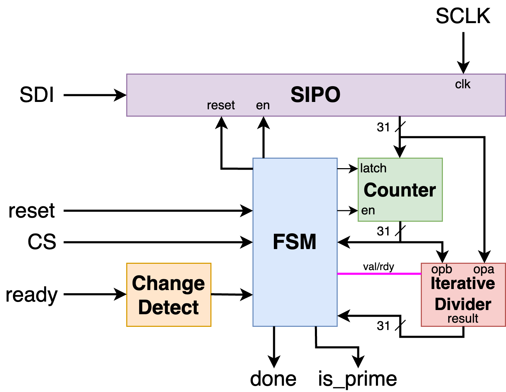

  

# 31-Bit Prime Detector

31-Bit Prime Detector is a hardware prime number detector for [Tiny Tapeout 3](https://tinytapeout.com). It takes in a shifted-in 31-bit number, and will determine whether it is prime or not.

## Block Diagram



The user input is shifted in through an SPI-like interface into a 31-bit shift-in, parallel-out register (SIPO). From here, the FSM control logic waits for a rising edge on the `ready` signal. It then proceeds to try and divide the value in the SIPO by all possibly values below it (up to `31'h00010000`, as the maximum possible value). If it finds a value that divides evenly, then it will stop and declare the number not prime (`done` is high, and `is_prime` is low). If it doesn't divide evenly by any of the numbers, it will declare the number prime (`done` and `is_prime` are high).

Not shown in the picture is one additional output, `waiting`, which displays whether the Prime Number Detector is currently waiting for another number to run.

Lastly, both `reset` and `ready` are buffered by registers to synchronize the inputs, and `SCLK` is debounced internally through sampling with a depth of 4 (i.e. the internal signal will only change to a value if all 4 samples agree). 

## Testing

### Dependencies

My testing infrastructure is based on Cocotb testing in Python with Pytest, automated with Makefiles. To run the tests, you will need Cocotb and Pytest installed, as well as either iverilog or verilator (with the tests being set up to use the former currently):

```bash
sudo apt install iverilog verilator
pip3 install cocotb pytest
```

You will also need to have `make` installed, although that is default on most systems.

### Running the Tests

To run the tests, navigate to `src/tests` and run `make all`. You will get an intuitive display of whether the tests pass or fail, as well as all of the testing outputs and artifacts in `src/tests/build`